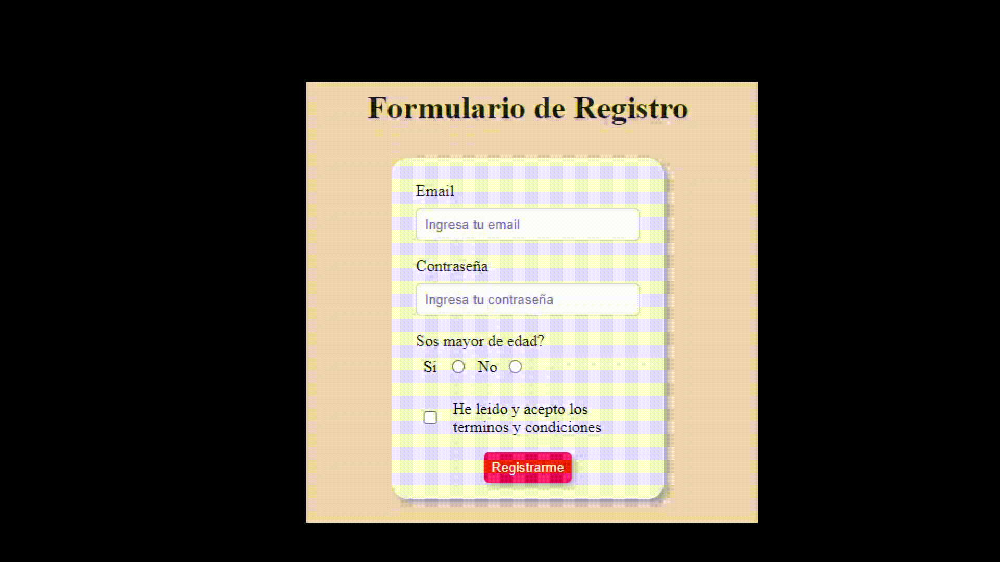

# Exercício de Prática. ✏️

Neste exercício, partiremos de um formulário de registro implementado anteriormente, onde o usuário vai inserir uma série de dados dos inputs correspondentes.

O exercício consiste em recuperar cada um desses valores usando os métodos que o Javascript nos fornece para isso, a fim de realizar algumas validações e mostrar o resultado esperado, conforme explicado em cada uma das etapas encontradas no arquivo index.js dentro da pasta scripts.js. ✔️

Para fazer isso, você deve examinar e prestar atenção às diferentes tags html e suas diferentes propriedades, para ver como você pode selecionar cada elemento usando javascript. 👀 👀 👀

Para resolver este exercício, você precisará escrever seu código no arquivo index.js localizado dentro da pasta ```scripts```

## Exemplo

Ao preencher o formulário da seguinte forma (modelo em espanhol):



O seguinte resultado deve ser obtido (modelo em espanhol):


Bora programar! 💻
